# LifeOS Folio

Avukatlar için evrak ve dilekçe uygulaması: Windows, Linux ve Android; macOS için deneme paketi. UDF, Word, Excel ve PDF dosyalarını Microsoft Office olmadan açıp düzenler. Dilekçede geçen kanun maddelerini ve Yargıtay kararlarını belgenin yanında gösterir. Evrakı e-imza ya da mobil imzayla imzalayıp UYAP'a gönderir. Bir UYAP dosyasını dilekçeye bağladığınızda dosyanın taraflarını, duruşma günlerini ve evrakını editörün yanında açar; evrakı seçerek ya da toplu indirir ve arşive katar. Yazdığınız metni Türkçe bir sesle okur, söylediklerinizi yazar. Belgeleriniz bilgisayarınızda kalır; arama ve düzenleme yerel olarak yapılır.

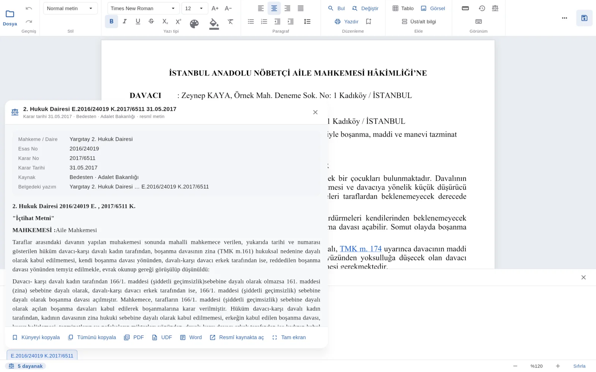

Ekran görüntülerindeki kişi ve dosya bilgileri uydurmadır; görüntüler `tool/screenshots` ile kurmaca veriden üretilir.

- [Sesli okuma ve sesli yazma](#sesli-okuma-ve-sesli-yazma)
- [Birden fazla pencere ve yazdırma](#birden-fazla-pencere-ve-yazdırma)
- [UYAP'a bağlanma](#uyapa-bağlanma) · [UYAP'a evrak gönderme](#uyapa-evrak-gönderme) · [UYAP Dosyalarım](#uyap-dosyalarım) · [UYAP dosyası editörün yanında](#uyap-dosyası-editörün-yanında)
- [Elektronik imzalı UDF](#elektronik-imzalı-udf) · [Arama ve otomatik indeksleme](#arama-ve-otomatik-indeksleme) · [Kanun maddesi ve emsal karar önizlemesi](#kanun-maddesi-ve-emsal-karar-önizlemesi)
- [Güncellemeler](#güncellemeler) · [macOS](#macos) · [Derleme](#derleme)

Dosyalar önce **önizlemeye** açılır. UDF/DOCX/XLSX/TXT/ODT için ayrı **Düzenle** düğmesi editörü açar; **Önizlemeye Dön** diskteki kaynak belgeyi gösterir. Masaüstünde UDF, DOCX, RTF, TXT ve ODT önizlemesinde sayfaya **çift tıklamak** da editörü açar: imleç çift tıklanan kelimeye gelir ve o satır görünümün ortasına kaydırılır. Satır, sayfanın kendi metin katmanından okunur ve komşu satırlarıyla birlikte aranır; böylece her paragrafın sonunda tekrarlanan bir cümlede de doğru yere gidilir. PDF'de çift tıklama editörü açmaz, çünkü PDF'yi düzenlemeye almak ayrıca onay istenen bir dönüşümdür. Sağa/sola 90° döndürme ve yakınlaştırma kaynak dosyayı değiştirmez. Fontlar yerel olarak paketlenir, UDF/PDF üretimi arka planda çalışır, son önizlemeler bellekte tutulur.

Uygulama içindeki arama sonucundan açıldığında arama ve sonuçlar solda, belge sağda tam yükseklikte görünür. İşletim sisteminden açılan bir belge ise sol panel kapalı geniş önizlemeye gelir. 56 px belge başlığı ve 42 px görüntüleme araç çubuğu dışında alan belgeye ayrılır. Önizleme de editör de sayfayı **%120** ile açar (%100, sayfanın 96 dpi'daki basılı boyutudur); pencere buna yetmiyorsa sayfa genişliğe sığdırılır. Böylece **Düzenle**'ye geçince sayfa aynı boyutta kalır. **Sayfaya sığdır** ve **Genişliğe sığdır** ayrıca seçilebilir. Kaydırma tutamacı, ilk/son sayfa ve genişletme düğmeleri bulunur. PDF sayfaları bellekte döndürülür; kaydırma dikey kalır ve kaynak PDF değişmez. Belgeye gömülmemiş fontlar yerel sistem fontları ve paketli Liberation fontlarıyla karşılanır; font için ağ bağlantısı kurulmaz.

## LifeOS Editör

Folio'nun yanında, aynı kurulumdan ikinci bir program: **LifeOS Editör** (`lifeos_editor.exe`, Linux'ta `lifeos_editor`). Yalnızca editörü açar, boş bir UDF ile başlar; arşiv, arama ve tepsi yüklenmez. Folio açık olsa da olmasa da kendi penceresinde çalışır, görev çubuğunda ayrı durur ve kalemli kendi simgesini taşır. Başlık çubuğundaki **Yeni** (Ctrl+N) ve **Aç** (Ctrl+O) ile başka belgeye geçilir; kaydedilmemiş değişiklik varsa önce sorulur. UDF, DOCX, DOC, RTF, ODT, TXT ve PDF açar. Avukat profili, kalıplar, belge geçmişi ve görünüm Folio ile ortaktır. Windows kurulumu Başlat menüsüne "LifeOS Editör" kısayolunu, isteğe bağlı masaüstü kısayolunu ve UDF/DOCX/RTF/ODT/TXT için "Birlikte aç" kaydını ekler; Linux'ta `install_local.py` menüye ayrı bir girdi koyar. Folio'nun içinde "Düzenle" eskisi gibi uygulamanın içinde açılır.

## Sesli okuma ve sesli yazma

Windows ve Linux'ta editörün araç çubuğundaki **Ses** grubunda iki düğme bulunur. **Sesli oku**, seçili metni ya da seçim yoksa imleçten sonrasını Türkçe bir kadın sesiyle okur. Okunan cümle sayfada seçili görünür ve sayfa sesi izler; alttaki çubukta kaçıncı cümlenin okunduğu, okuma hızı, duraklatma ve durdurma vardır. Metin okunmadan önce Türkçe okunuşuna çevrilir: "TMK m. 166" "Türk Medeni Kanunu'nun yüz altmış altıncı maddesi" olarak, tarihler, sayılar, para tutarları ve dava kısaltmaları açılarak okunur. Kısaltmalar `assets/ses/okuma.json` dosyasında, kanun adları kanun listesinde tutulur. Bir bölümü seçip sağ tıklayınca menüdeki **Sesli oku** yalnız o bölümü okur. Önizlenen metin belgelerinde de aynı düğme bulunur.

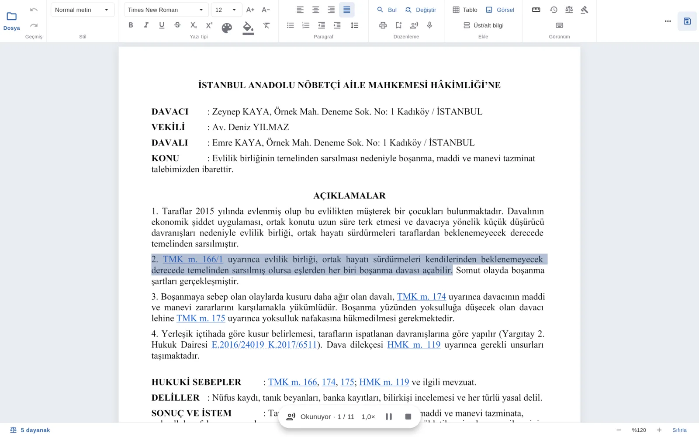

**Sesli yaz** açıkken söylenenler imlecin bulunduğu yere yazılır. Konuşma, sessizlik algılayıcısıyla cümlelere bölünür ve her cümle bittiğinde yazıya geçer; **Bitir**'e basıldığında son cümle de yazılır.

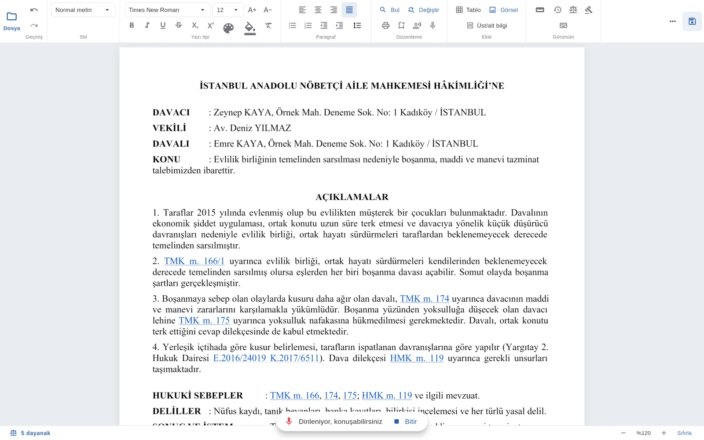

Okuma ve yazma tamamen bilgisayarda yapılır; ses ve metin hiçbir sunucuya gönderilmez. Bunun için iki model kullanılır ve uygulamaya gömülmez: okuma için Supertone'un **Supertonic 3** modeli (yaklaşık 125 MB indirme), yazma için OpenAI'nin **Whisper large-v3 turbo** modeli ve Silero sessizlik algılayıcısı (yaklaşık 610 MB indirme). Bir özellik ilk kez kullanıldığında indirme boyutu gösterilir ve onay istenir; indirme ilerleme çubuğuyla izlenir, yarıda kalırsa kaldığı yerden sürer. Modeller `lifeos.com.tr/ses/` adresinden sıkıştırılmış olarak gelir; her dosyanın SHA-256 özeti açıldıktan sonra denetlenir. İkisi de [sherpa-onnx](https://github.com/k2-fsa/sherpa-onnx) ile ayrı bir iş parçacığında çalışır; arayüz donmaz. Android'de sesli okuma ve yazma yoktur.

## Birden fazla pencere ve yazdırma

Önizlemedeki **Yeni pencerede düzenle** belgeyi kendi editör penceresinde açar; editörün **Dosya** menüsündeki **Yeni pencere** boş bir editör penceresi açar. Böylece iki dilekçe yan yana düzenlenebilir. Her pencere ayrı bir süreçtir. Aynı belge iki pencerede birden düzenlenemez, çünkü biri ötekinin kaydını ezerdi: belge başka bir pencerede açıksa editör bunu bir uyarı şeridiyle bildirir ve belge açık olduğu pencerede düzenlenir. Taslak kurtarma da pencere başınadır; başka bir pencerenin açık taslağı kurtarılacak diye listelenmez. Dilekçenin yanında açılan bir UYAP evrakı **Ayrı pencerede aç** ile kendi penceresine taşınır ve örneğin ikinci ekrana alınabilir.

Önizlemede ve editörde **Yazdır** (Ctrl+P) önce sayfaları gösterir; yazdırılacak sayfalar seçilebilir.

## Yeni belge ve hızlı bakış

Ana sayfadaki **Yeni belge oluştur** (ve **Ctrl+N**) UDF, Word DOCX veya TXT seçimi açar. İlk **Kaydet / Ctrl+S** seçilen uzantıyı önerir. UDF ve DOCX biçimlendirmeyi korur; TXT düz metindir. Masaüstünde yeni UDF için **UDF e-imzala** önce dosyayı kaydettirir, sonra imzayı aynı UDF dosyasına kaydeder; imza öncesi sürüm belge geçmişinde saklanır; DOCX/TXT için imzalama sunulmaz. Android'de UDF yalnız mobil imzayla imzalanır.

Evraklar ve arama sonuçlarında fareyle yaklaşık yarım saniye beklemek **Hızlı bakış** kartını açar. Kart, aradığınız sözcüğün belgedeki **geçtiği yerleri** öncesi ve sonrasıyla gösterir; sözcükler vurgulanır, altta toplam eşleşme sayısı yazar. Böylece belgeyi açmadan doğru metin olup olmadığı görülür. En çok üç bölüm gösterilir; metin indeksten okunur, sayfa çizilmez. Arama yapılmadan gezinirken belgenin ilk satırları görünür. Görsellerde küçük resim ve belge adı gösterilir; imleç satırdan ayrılınca, tıklayınca, kaydırınca veya **Esc** ile kapanır. **Ayarlar → Üzerine gelince hızlı önizleme** başlangıçta açıktır ve seçim hatırlanır. Görsellerin küçük görüntüleri sınırlı bellekte tutulur, aynı anda tek iş çalışır; 8 MB üzerindeki görseller için küçük görüntü üretilmez. Aranabilir metni olmayan belgelerde (taranmış PDF, çevrimdışı saklanan bulut dosyası) bunun sebebi yazılır; tam önizleme tıklamayla açılır.

## Excel önizleme, düzenleme ve arama

XLSX dosyaları ana sayfada **Excel** filtresiyle listelenir. Bütün çalışma sayfalarının hücre metinleri, mevcut formül sonuçları ve sayfa adları ortak indekse girer; ana uygulama ve tray araması aynı içerikten kısa alıntı gösterir. Eklenen/değiştirilen dosyalar mevcut klasör izleyicisiyle güncellenir.

Önizleme çalışma sayfası sekmeleri, hücre araması, temel renk/kalın yazı ve yaygın tarih/sayı biçimlerini gösterir.

**Düzenle** gerçek bir tablo editörü açar (deneme sürümü). Hücreye doğrudan ya da üstteki formül çubuğundan değer veya formül yazılır. Geri al/yinele, kalın/italik/altı çizili, yazı ve dolgu rengi, hizalama, metni kaydırma, hücre birleştirme ve ayırma, sayı biçimleri (sayı, tam sayı, ₺ para, yüzde, tarih, tarih-saat), sürükleyerek sütun genişliği ve satır yüksekliği, sayfada bul (**Ctrl+F**) ve yakınlaştırma vardır. Dosyadaki dondurulmuş satır/sütunlar korunur. Seçili hücrelerin toplamı, ortalaması ve sayısı altta görünür. Formüller Türkçe Excel'deki gibi yazılabilir: `=TOPLA(A1;A9)` dosyaya Excel'in kendi biçimiyle `=SUM(A1,A9)` olarak kaydedilir. Bir hücre değişince ona bağlı formüller hemen yeniden hesaplanır; dokunulmayan formüller Excel'in son hesapladığı sonucu gösterir. **Ctrl+S** kaydeder; kaydetmeden çıkış uyarısı, belge geçmişi ve taslak kurtarma desteği vardır. Görünen satır/sütunlar çizilir; büyük sayfada bütün ızgara baştan çizilmez.

Dokunulmayan hücreler dosyaya okunduğu gibi geri yazılır: 20 gerçek çalışma kitabında aç-kaydet sonrasında değer, biçim ya da dosya parçası kaybı görülmedi. Satır/sütun ekleme ve silme henüz yoktur; formül başvuruları kaydırılamadığı için bilerek kapalı tutuldu. Hesaplama motoru Excel'in bütün işlevlerini tanımaz; tanımadığı bir formülde Excel'in bulduğu sonuç korunur, yerine hata yazılmaz. Gelişmiş editörün açamadığı bir dosya eski basit editörle açılır ve bu ekranda belirtilir. Grafikler ve resimler editörde gösterilmez. Korumalı sayfalar ve dijital imzalı kitaplar salt okunur. Eski `.xls` desteklenmez. E-imza işlemi Excel için sunulmaz.

**Esc** önce açık menü/pencere/hızlı bakışı kapatır, ardından editör → önizleme → arşiv adımlarıyla geri döner; kaydedilmemiş değişiklikler için karar sorulur. Arşivde önce arama, sonra filtre temizlenir. Belge işlemleri hem önizleme hem editörde ayrı bir menü penceresinde açılır.

TIFF önizlemesi dosya başına bir çözümleyici kullanır, komşu sayfaları hazırlar ve sınırlı bellek önbelleğinde tutar. Ekran için üretilen küçük görüntü PDF dönüşümünde kullanılmaz: kaynak pikseller ve sayfa DPI ölçüleri korunur.

## Düzenleme geçmişi ve kurtarma

Editörden önizlemeye/arşive geçiş, başka belge açma, yeni belge ve pencere/tray kapatma işlemleri kaydedilmemiş değişikliklerde **Kaydet / Kaydetmeden çık / Vazgeç** seçeneklerini sunar. İptal edilen veya başarısız kayıt editörden çıkarmaz. Metin, biçim ve cetvel değişiklikleri takip edilir.

**Belge geçmişi** her belge için ayrı bir pencerede açılır: önizlemede başlıktaki saat simgesinden (telefonda **Belge işlemleri → Belge geçmişi**), editörde araç çubuğundaki **Belge geçmişi** düğmesinden. Solda sürümler gün gün listelenir: Folio'da kaydedilen sürüm, üzerine yazılmadan önceki hali, e-imzadan önceki ve sonraki hali, eski sürüme dönüş. E-imzalı sürümler işaretlidir. Sağda seçilen sürüm **Şimdikiyle karşılaştır** ile kelime kelime (sonradan eklenen yeşil, silinen üstü çizili kırmızı; değişmeyen uzun bölümler kısaltılır) ya da **Sayfa görünümü** ile sayfa sayfa incelenir. **Kopya olarak kaydet…** sürümü ayrı bir dosyaya yazar. Editörde **Editöre yükle** sürümü kaydedilmemiş değişiklik olarak açar; dosya ancak kaydedince değişir. Önizlemede **Bu sürüme dön** dosyayı o sürümle değiştirir ve dosyanın o anki halini geçmişe ekler, yani dönüş de geri alınabilir. Belge başına son 20 sürüm, en fazla 100 MB tutulur; değişmeyen kopyalar çoğaltılmaz. Geçmiş yalnız Folio'da yapılan kayıtları ve e-imzaları kapsar.

Kaydedilmemiş taslaklar yaklaşık 10 saniyelik aralıklarla ve uygulama arka plana geçtiğinde uygulamanın yerel veri dizinindeki `document-history` klasörüne yazılır. Her editör oturumunun taslağı ayrıdır: ani kapanıştan sonra aynı belgeyi yeniden açmak, düzenlemek ya da pencereyi küçültmek önceki oturumun taslağını silmez. Açık bir editörün taslağı kurtarılacak diye listelenmez. Bekleyen taslakların sayısı ana sayfadaki **Kurtarılabilir taslaklar** düğmesinde görünür; açılışta ayrıca bildirim çıkmaz. Taslağı kalmış bir belge açılınca editör araç çubuğunda sessiz bir taslak simgesi belirir; taslak oradan açılır ya da silinir. Hiç kaydedilmemiş belgeler de kurtarılır. Başarılı kayıt veya açıkça **Kaydetmeden çık** seçimi taslağı temizler; değişiklikleri geri alınarak kapanan editör taslak bırakmaz. Son kurtarma kaydından sonraki birkaç saniye ani güç kesintisinde kaybolabilir. Bu, harici yedeklemenin yerine geçmez; belgeler ve taslaklar sunucuya gönderilmez.

E-imzalı bir UDF masaüstünde kaydedilirken ne yapılacağı sorulur. **Üzerine kaydet** dosyayı değişikliklerle, imzasız olarak günceller; imzalı hali belge geçmişinde byte byte saklanır ve oradan geri dönülebilir. İmzalı hal geçmişe yazılamazsa dosyanın üzerine yazılmaz. **İmzasız kopya kaydet…** imzalı dosyayı olduğu gibi bırakıp değişiklikleri yeni bir dosyaya yazar.

Bildirimler ekranın altında kendiliğinden kapanan küçük kartlar olarak görünür; yenisi gelince öncekinin yerini alır, sıraya girmez.

Mobilde kart, PIN ve e-imza ayarı sunulmaz; UDF mobil imzayla imzalanabilir. İmzalı belgeler önizlenebilir, imza bilgileri incelenebilir ve dokunmatik editörde düzenlenebilir. Mobilde imzalı kaynağın üzerine yazılmaz; kayıt sistemin kaydetme ekranıyla imzasız kopya olarak yapılır. Telefonda cetveller başlangıçta kapalıdır, araç menüsünden ayrı ayrı açılabilir.

## İlk açılış ve hakkında

İlk açılışta kısa tanıtım, Beyaz/Siyah/Sistem tema seçimi, ücretsiz kullanım lisansı ve isteğe bağlı indeks klasörü seçimi bulunur. Onay ve seçimler hatırlanır. Sonraki açılışlar doğrudan uygulamaya gider. **Hakkında** ekranında Erkan ÖZ, lifeos.com.tr, erkanoz.com, [ücretsiz kullanım lisansı](assets/legal/LICENSE.txt) ve bileşen lisansları yer alır.

Linux ve Windows'ta ince uygulama başlığı; küçültme, büyütme, tam ekran (F11), kapatma ve hakkında düğmelerini taşır. [Masaüstü davranışı ve GNOME kayıt düzeltmesi](docs/folio-desktop.md).

## Desteklenen biçimler

| Kaynak | Önizleme | Dönüşüm hedefleri |
|---|---|---|
| UDF, DOCX, TXT | Sayfalı belge; ayrı editör | Diğer iki belge biçimi ve PDF |
| PDF | Kaynak PDF; metin katmanını düzenlenebilir kopyaya aktarma | DOCX, UDF, TXT; metin katmanı gerekir |
| ODT, HTML/HTM, Markdown | Temel içerikten sayfalı önizleme | PDF, TXT |
| PNG, JPEG, BMP | Görsel | PNG, TIFF, PDF; aynı uzantı tekrar sunulmaz |
| GIF, WebP | Görsel | PDF; kareler korunur, animasyon hareketi PDF'de yoktur |
| Excel XLSX | Çalışma sayfaları ve hücreler; ayrı editörde kaydetme | — |
| TIFF/TIF | Çok sayfalı görsel | PDF |
| SVG | Vektör önizleme | — |
| CSV, TSV, JSON, XML, LOG | Salt okunur metin; JSON biçimlendirme | — |

Belge ve görsel toplu dönüşümleri ayrı menülerdedir. Yalnız seçilen grubun ortak desteklenen hedefleri sunulur. Zaten hedef biçimdeki dosyalar atlanır. Çıktılar kaynak dosyaları ezmez; çakışmada yeni ad oluşturulur. Taranmış PDF → metin dönüşümü için önce **Ayarlar → Taranmış belgeleri oku (OCR)** açılmalıdır. DOC, RTF, eski XLS ve PPT/PPTX şu anda desteklenmez.

ODT/HTML/Markdown önizlemesi temel metin, biçim ve tabloları kullanır; özgün sayfa düzeninin tamamını korumaz. HTML/CSS çalıştırılmaz, harici kaynaklar yüklenmez. CSV/TSV bir hesap tablosu editörü olarak açılmaz. SVG harici kaynakları reddeder.

## Arama ve otomatik indeksleme

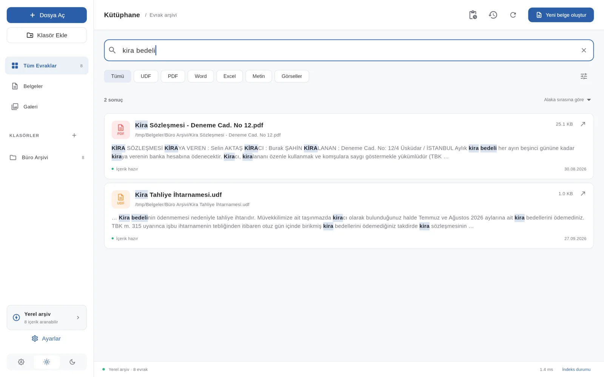

**Ayarlar → Arşiv klasörleri → Klasör seç ve ekle.** Alt klasör seçimi her kaynak için ayrı saklanır. PDF (metin katmanı), UDF, DOCX, ODT, TXT, HTML, Markdown ve desteklenen veri dosyalarının metni indekslenir; görseller dosya adıyla aranır. Kaynak dosyalar değiştirilmez; arşivden çıkarmak belgeleri silmez.

- Ana sayfada dosya adı + içerik arama, eşleşen bölümden kısa ve vurgulu alıntılar, biçim/klasör filtreleri ve sıralama. Sonuca tıklamak önizlemeyi açar.
- **Son aramalar** bu cihazda tutulur; tek tıkla yeniden çalıştırılır veya temizlenir. **Yeni eklenenler**, ilk indeksleme zamanına göre sıralanır; belgenin eski değişiklik tarihinden etkilenmez.
- Linux/Windows: ekleme, düzenleme, taşıma ve silme olayları izlenir. Değişiklikler 700 ms birleştirilir; boyut/mtime/ctime değişmemiş içerikler tekrar ayrıştırılmaz. Uygulama yeniden açıldığında kapalıyken yapılan değişiklikler de taranır. Bir tarama kaynak klasör başına tek veritabanı işlemiyle yazılır.
- Okunamayan bir belge, dosyanın kendisi değişene veya **Ayarlar → İndeks durumu → Yeniden tara** seçilene kadar yeniden ayrıştırılmaz. OneDrive gibi sağlayıcıların cihaza indirilmemiş dosyaları bu duruma girer ve "çevrimdışı saklanıyor" notuyla gösterilir; her açılışta tekrar açılmaya çalışılmaz. Yarım kalan işler ise sonraki açılışta kaldığı yerden sürer.
- Android: sistem klasör seçicisiyle kalıcı okuma izni alınır. Yalnız desteklenen dosyaların birebir kopyaları uygulamanın özel alanına alınır; sonraki taramalarda yalnız değişen kopyalar yenilenir. Sağlayıcının değişiklik bildirimleri, öne dönüşte tarama ve uygulama öndeyken 30 saniyelik yedek tarama kullanılır. İzin kaldırılırsa önceki indeks korunur ve erişim hatası gösterilir. İndeks ve kopyalar için cihazda boş alan gerekir.
- SQLite FTS5/WAL ayrı isolate içinde; belge ayrıştırma ayrı ve iptal edilebilir isolate işlerinde çalışır. 180 ms arama gecikmesi yazmayı akıcı tutar. Sonuçlar 50'şer yüklenir; her aramada kaynak belgeler açılmaz. Doğrudan açılan belge ilk indekslemenin bitmesini beklemez.
- Türkçe İ/ı ve aksanlar toleranslıdır. Sözcükler AND ile, sonları önek aramasıyla eşleşir; tırnak içi ifadeler ardışık aranır. Ham SQL/FTS operatörleri çalıştırılmaz.

64 MB üzerindeki dosyalar yalnız adlarıyla indekslenir. İçerik dosya başına 32 milyon karakterle sınırlıdır; kısmi/başarısız metinler durum bilgisiyle gösterilir. Ayrıştırma işi 30 saniyede kesilir; OCR açıkken bu süre 3 dakikaya çıkar. OCR kapalıyken taranmış PDF ve resimlerin içindeki yazı aranmaz. Erişilemeyen klasörlerde önceki sonuçlar korunur; tamamıyla boşaltılmış erişilebilir klasörlerin eski kayıtları temizlenir. Sembolik bağlantılar izlenmez.

Arama tasarımında [lifeoshukuk](https://github.com/07erkanoz/lifeoshukuk/tree/bad89170b38722914dda76019863c712503c9a77) içindeki FTS5, arka plan indeksleyici ve klasör izleme akışları incelendi. Yeni uygulama; kaynak üyeliği, güvenli sorgu üretimi, silme takibi ve çoklu belge ayrıştırmayı kendi servisleriyle uygular. 10.000 kısa örnek kayıtta yerel FTS sorgusu yaklaşık 1,5–2,6 ms ölçüldü; bu sayı dosya açma veya uçtan uca arayüz süresi değildir.

## Kanun maddesi ve emsal karar önizlemesi

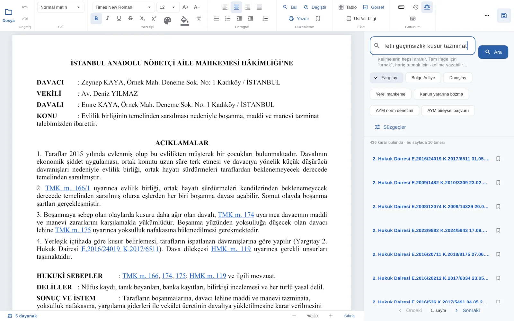

Editörde ve PDF önizlemesinde belgede geçen kanun maddeleri (düz altı çizili) ve yüksek mahkeme kararları (noktalı altı çizili) işaretlenir; tıklanınca kaynağı açılır. Tanınan yazımlar: `TMK m. 166/1-a`, `HMK'nın 297. maddesi`, `6100 sayılı Kanun'un 119. maddesi`, `2942 sayılı Kanun m. 11`, `TBK'nın 49, 50 ve 51. maddeleri`, `Anayasa'nın 2. ve 38. maddelerine`, `aynı Kanun'un 7. maddesi`, harfli/geçici/ek madde (`İİK 68/a`, `HMK geçici m. 3`), Romen fıkra (`TBK m. 479/II`), noktalı kısaltma (`H.M.K.`), büyük harfle yazılmış atıf; kararda `2016/1531 E., 2017/3344 K.`, `E: … K: …`, `Esas No: … Karar No: …`, `2014/140 Esas, 2015/85 Karar sayılı`, `(E) ve (K)`, HGK'nın daireli esası (`2011/7-695 E.`), yazıyla daire (`Danıştay Dördüncü Dairesi`) ve AYM bireysel başvurusu (`AYM, … B. No: 2019/19126`). Hangi kısaltmanın hangi kanun, hangi mahkemenin kararlarının yayımlandığı `assets/mevzuat/laws.json` (89 kanun) ve `courts.json` veri paketlerindedir. 2.606 belgelik gerçek arşivde yeni tanıma 4.814 yerine 6.568 kanun atfı, 469 yerine 861 getirilebilir karar atfı buldu; eski tanımanın yakalayıp yeninin bıraktığı 113 kayıt süre ("7 AY 15 GÜN"), kimlik numarası ve damga kodu gibi yanlış alarmlardı.

Önizleme künyeyi hemen, metni kaynak cevap verince gösterir. Künye (mahkeme/daire, esas, karar, karar tarihi, Resmî Gazete, kaynak, belgedeki yazım) seçilebilir; metin kaynağın kalın, eğik ve hizasıyla, dilekçe yazı tipinde gelir. **Künyeyi kopyala**, **Tümünü kopyala** (biçimiyle; Word'e ve editöre kalınıyla yapışır), **PDF**, **UDF**, **Word**, **Resmî kaynakta aç** ve **Tam ekran** düğmeleri vardır; kopyalanan ve kaydedilen belgenin başında künye yazar. Belgede yazan daire ile bulunan karar farklıysa bu söylenir. "Bakıldı, yayımlanmamış" ile "bakılamadı" ayrı cümlelerdir; bakılamadıysa **Yeniden dene** çıkar. Telefonda önizleme tam ekran açılır.

Kaynaklar: madde metni önce UYAP/Bedesten'in tek madde servisinden (maddenin kendi başlıklarıyla), olmazsa mevzuat.gov.tr'deki kanun metninden; Yargıtay, Danıştay ve bölge adliye kararları Bedesten'den, bölge adliye kararı orada yoksa UYAP Emsal'den; Anayasa Mahkemesi kararları AYM Kararlar Bilgi Bankası'ndan (norm denetimi esas/karar sayısıyla, bireysel başvuru başvuru numarasıyla). Dışarı yalnız kanun/madde numarası ya da esas/karar numarası gider, belgenin metni gitmez. Bankalar kararların yalnız bir bölümünü yayımlar. Bölge idare mahkemesi (BİM) kararları bu bankaların hiçbirinde bulunmadığı için işaretlenmez. İlk derece mahkemesi numaraları da işaretlenmez: dilekçede çoğunlukla yazanın kendi dosyasıdır.

Karar araması (editörde yanda açılan panel dahil) Yargıtay, bölge adliye, Danıştay, yerel mahkeme ve kanun yararına bozma bankalarının yanında **AYM norm denetimi** ve **AYM bireysel başvuru** seçeneklerini de sunar; her sonucun yanında **Künyeyi kopyala** vardır, açılan karar aynı önizlemeyle gelir.

## İsteğe bağlı editör

Geniş ekranda yazı tipi, paragraf, düzenleme ve görünüm araçları iki satırlı gruplar halinde görünür. Sistem yazı tiplerinde arama, gerçek punto gösterimi ve özel punto, alt/üst simge, renk/vurgu, dört hizalama, listeler, girinti, satır aralığı ve metin stilleri kullanılabilir. Dar ekranlarda aynı biçimlendirme araçlarına ek menüden ulaşılır. Yatay ve dikey cetvel ayrı ayrı kapatılır.

**Ctrl+F** belgede bulmayı, **Ctrl+H** bul/değiştirmeyi açar. Türkçe büyük/küçük harf, tam sözcük, önceki/sonraki eşleşme, tek değiştirme ve tümünü değiştirme desteklenir. Tümünü değiştir tek adımda geri alınır; korunan tablo/görsel yer tutucuları değiştirilmez. **Ctrl+S**, **Ctrl+Shift+S**, **Ctrl+B/I/U**, **Ctrl+L/E/R/J**, **Ctrl+M** ve **Ctrl+Shift+M** editör kısayollarıdır.

Önizleme ana işlevdir. **Düzenle** tıklanmadan editör yüklenmez. UDF/DOCX/TXT/ODT, biçimli editörde açılıp UDF/DOCX/PDF/TXT olarak ayrı kaydedilebilir. PDF'de **Düzenle**, varsa metin katmanını düzenlenebilir yeni belgeye aktarır; kaynak PDF'yi değiştirmez ve sayfa yerleşimi, imza, form ve açıklamaları birebir yeniden kurmaz. Taranmış PDF için önce OCR gerekir. ODT'ye geri yazma henüz yoktur. Markdown, HTML, JSON, XML, CSV, TSV ve LOG kaynak metin editöründe düzenlenir ve kendi uzantısıyla UTF-8 kopya olarak kaydedilir. Önizlemeye dönüş diskteki belgeyi gösterir; kaydedilmemiş taslak aynı oturumda korunur. Android kaydetme/dönüştürme `ACTION_CREATE_DOCUMENT` ile sistemin izinli dosya kaydetme ekranını kullanır; genel depolama izni istemez. UDF dahil MIME türü açıkça gönderilir. Seçilen `content://` konumuna yazma tamamlandıktan sonra başarı bildirilir; önizleme ve paylaşım için uygulamanın özel alanında okunabilir bir kopya tutulur. İptal veya yazma hatası taslağı kaydedilmiş saymaz.


## UDF sayfa düzeni: önizleme ve editör aynı

Önizleme ve editör bir paragrafın satırlarını, sekmelerini ve girintilerini tek bir ortak yerleşimden (`lib/services/layout/paragraph_rows.dart`) alır; ikisi yalnız yazıyı kendi ölçer. Kurallar UYAP'ın kendi editöründen ölçülerek çıkarıldı (editör sanal ekranda çalıştırılıp her karakterin konumu soruldu):

- Sekme durakları sol girintiden sayılır. Paragrafın durakları biterse sekme **5 pt** ilerler (72 pt'lik durağa atlamaz); hiç durağı olmayan paragrafta her 72 pt'de bir durak vardır. Sekme öncesindeki kalem konumu tam puntoya yuvarlanır ve bir sekme hiçbir zaman bir boşluktan dar olmaz.
- Orta ve sağ duraklar izleyen metni durağa göre ortalar/sağa dayar. Satıra sığmayan sekme alt satıra geçer ve durağı oradan sayılır.
- İlk satır `LeftIndent + FirstLineIndent`, sonraki satırlar `LeftIndent + Hanging` (asılı girinti; mahkeme kararlarının başlıklarında) konumundan başlar. Girinti ve paragraf boşlukları UYAP gibi tam puntoya kırpılır.
- Satır yalnız boşlukta kırılır; "Manavgat/ANTALYA" gibi sözcükler bütün olarak alt satıra geçer. Paragraf içindeki satır sonu UYAP'ta çizilmez; önizleme ve editör de çizmez (Word belgelerindeki satır sonu Word'deki gibi kırılır).
- İki yana yaslı satırda sekme ve ilk satır girintisi genişletilmez; satır başındaki boşluk yer kaplamaz.
- Harf aralığı UYAP ve önizlemedeki gibi karakter genişliğindedir; editörde kerning ve bitişik harf kapalıdır.

UYAP'la kalan farklar bir boşluk genişliğinin altındadır (UYAP'ın kendi tamsayı yuvarlamaları). Word belgelerinde sekmeler kenar boşluğundan sayılır ve belgenin varsayılan durak aralığı (`settings.xml`, çoğunlukla 1,25 cm) kullanılır.

## Biçimli kopyala ve yapıştır

Yapıştırılan metin, nereden kopyalanırsa kopyalansın yazı tipini, puntosunu, kalın/italik/altı çizili/rengini, hizasını, girintilerini, sekme duraklarını, satır aralığını, listelerini, tablolarını ve görsellerini korur. UYAP'ın kendi editörü Word'den ya da bir web sayfasından gelen metni düz metin olarak yapıştırır; Folio yapıştırırken panodaki en zengin biçimi, dosyaları açan okuyucularla okur:

- **Folio'nun kendi kopyası** (başka bir Folio penceresinden): belge modeli olduğu gibi gelir. 200 gerçek UDF'de (1,46 milyon karakter, 11.471 paragraf) metin, tablo, görsel ve bütün paragraf özellikleri birebir aynı çıktı.
- **UYAP editörü**: UYAP panoya kendi Java nesnesini koyar (HTML/RTF koymaz). Folio bu akışı Java çalıştırmadan veri olarak çözer ve UYAP'ın öğe ağacını UDF okuyucusundan geçirir: sekme durakları, asılı girinti, listeler, tablolar, e-imza görseli dahil. UYAP'ta açılıp kopyalanan 125 gerçek belgede 997.912 karakterin ve 6678 paragrafın tamamı, aynı belgenin dosyadan açılmış haliyle aynı.
- **Word ve LibreOffice**: RTF, HTML'den önce okunur. LibreOffice'ten kopyalanan 40 belgede HTML paragrafların %8'inde satır aralığını, %10'unda paragraf sonrası boşluğu kaybetti; RTF %2'sinde.
- **Web tarayıcısı, Google Docs**: HTML; Chrome'un satır içi hesaplanmış stilleri, Word'ün `mso-*` listeleri/sekmeleri, Google Docs'un liste içi paragrafları okunur. Gerçek Chrome panosu üzerinden 30 belgede karakter biçiminde tek bir fark kaldı.

Kopyalanan paragraf sonu da hesaba katılır: bir paragrafın ortasından kopyalanan sözcükler yapıştırıldığı cümleyi bölmez; tam paragraf kopyalandıysa kendi hizası ve girintisiyle gelir; boş bir satıra yapıştırılan paragraf kendi düzenini alır. Yapıştırma tek adımda geri alınır ve imleç yapıştırılanın sonuna gelir. Üst/alt bilgi ve tablo hücreleri de aynı yolu kullanır (tablo orada sekmeli satırlara dönüşür).

Folio'dan kopyalarken panoya HTML, RTF ve düz metin birlikte yazılır: Word, LibreOffice, tarayıcı ve e-posta biçimi korur; düz metin isteyen program tabloyu sekmeli satırlar olarak alır. Linux'ta GTK panosuna, Windows'ta `HTML Format`/`Rich Text Format`/Unicode metin olarak, Android'de HTML'li `ClipData` ile yazılır.

## Elektronik imzalı UDF

Önizlemedeki imza bandı ve **Ayrıntılar** ekranı; imzacı adı, sertifika sağlayıcısı, kurum, sertifika kimlik alanı/seri numarası, beyan edilen imza zamanı ve sertifika tarihlerini mevcutsa gösterir. Birden fazla imzacı ve karşı imzalar ayrı listelenir. Sertifika, imza kaydındaki issuer+serial veya subjectKeyIdentifier ile eşleştirilir; arşivdeki ilk sertifika imzacı varsayılmaz ([CMS RFC 5652 §5.3](https://www.rfc-editor.org/rfc/rfc5652#section-5.3)).

İmza verisi çözülemese de varlığı ve okunamadığı gösterilir. Bilgilerin okunması **kriptografik doğrulama değildir**; güven zinciri, iptal ve belge bütünlüğü doğrulanmaz. Beyan edilen saat doğrulanmış zaman damgası sayılmaz.

**Yeni UDF imzası:** Önizlemedeki (ve editördeki) **UDF e-imzala** imza penceresini açar. İki yol vardır: **E-imza kartı** ve **Mobil imza**. Pencere son kullanılan yolu hatırlar. İki yolda da imza **aynı UDF dosyasına** yazılır, imzadan önceki hali belge geçmişinde saklanır ve dosya imza sırasında başka bir yerden değiştirildiyse üzerine yazılmaz.

*E-imza kartı:* Ayarlar → E-imza ayarları bölümünden PKCS#11 sürücüsü otomatik algılanır veya `.so`/`.dll` yolu seçilir. Kart, PIN ve sertifika seçilir; kaynak `content.xml` byte'ları üzerinde RSA/SHA-256 CAdES-BES imza oluşturulur ve `sign.sgn` olarak eklenir. Kartla, zaten imzalı bir belgeye ikinci imza eklenmez.

*Mobil imza:* Cep telefonu numarası yazılır, operatör (Turkcell, Türk Telekom, Vodafone) seçilir ve **Mobil imzayla imzala**'ya basılır. Pencerede bir doğrulama kodu belirir; telefona gelen bildirimdeki kod aynıysa onaylanır. Onay birkaç dakika sürebilir; **Beklemeyi bırak** ile vazgeçilirse belge değişmez. Zaten imzalı bir belgede yeni imza, mevcut imzacıların yanına aynı `sign.sgn` içine eklenir (UYAP'ın çok imzalı belgeleri tuttuğu gibi); belgenin metni değişmez. Numara yalnız istenirse ve yalnız bu cihazda hatırlanır.

Mobil imza, UYAP editörünün de kullandığı UYAP mobil imza servisiyle (`vatandas.uyap.gov.tr`, HTTPS) yapılır. İmza için belgenin `content.xml` metni ve telefon numarası bu servise gönderilir; başka bir yere bir şey gönderilmez. Servisten dönen imzanın gerçekten bu belgenin metnini kapsadığı kaydetmeden önce kontrol edilir; kapsamayan imza kaydedilmez. Mobil imza masaüstünde (Windows ve Linux) ve Android'de sunulur; Android'de imza penceresi yalnız mobil imzayı gösterir. Akış yerel bir deneme sunucusuyla uçtan uca test edildi; gerçek bir mobil imza hattıyla ve UYAP kabulüyle henüz denenmedi.

Kart işlemleri arka planda çalışır; PIN diske/loga yazılmaz ve hatalı PIN otomatik tekrar denenmez. Sertifika tarihleri ve üretilen RSA imzasının seçilen sertifikayla eşleşmesi kontrol edilir. Sertifika güven zinciri, iptal/OCSP ve nitelikli zaman damgası doğrulanmaz. İmzalama çekirdeği kullanıcının `karararama` projesinden uyarlanmıştır; portal bağlantısı gerektirmez. Windows/Linux'ta uyumlu 64 bit kart sürücüsü gerekir; Android'de kartla yeni imzalama yoktur. CAdES zarfı ve bütünlüğü OpenSSL ile otomatik test edildi; gerçek kart/PIN ve UYAP kabul testi donanım olmadan yapılmadı.

İmzalı bir belgeyi editörde açmak imzayı silmez. Editörden kaydedilen belge ise imzasızdır: masaüstünde kaydederken **Üzerine kaydet** ya da **İmzasız kopya kaydet…** seçilir (ayrıntısı “Düzenleme geçmişi ve kurtarma” bölümünde); imzalı hal belge geçmişinde saklanır. Kaydedilen belge sonra yeniden imzalanabilir. UDF yerel modele göre çizilir; bütün UYAP özelliklerinde birebir sayfa eşleşmesi garanti edilmez.

| E-imza kartı | Mobil imza |
|---|---|
| 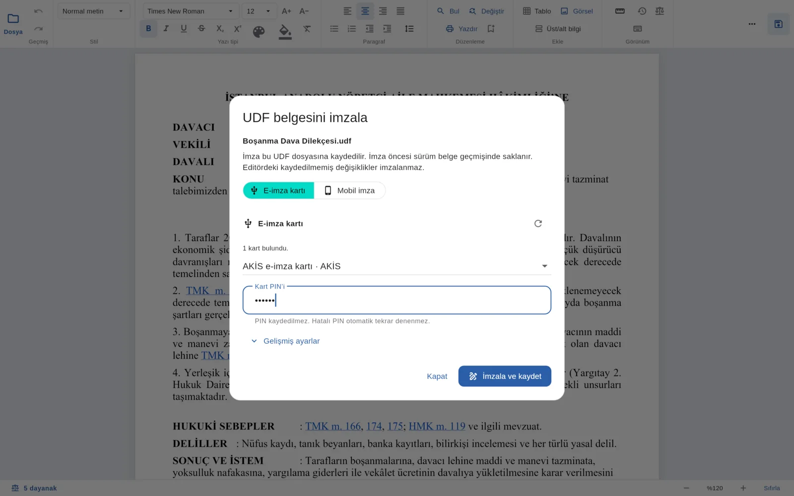 | 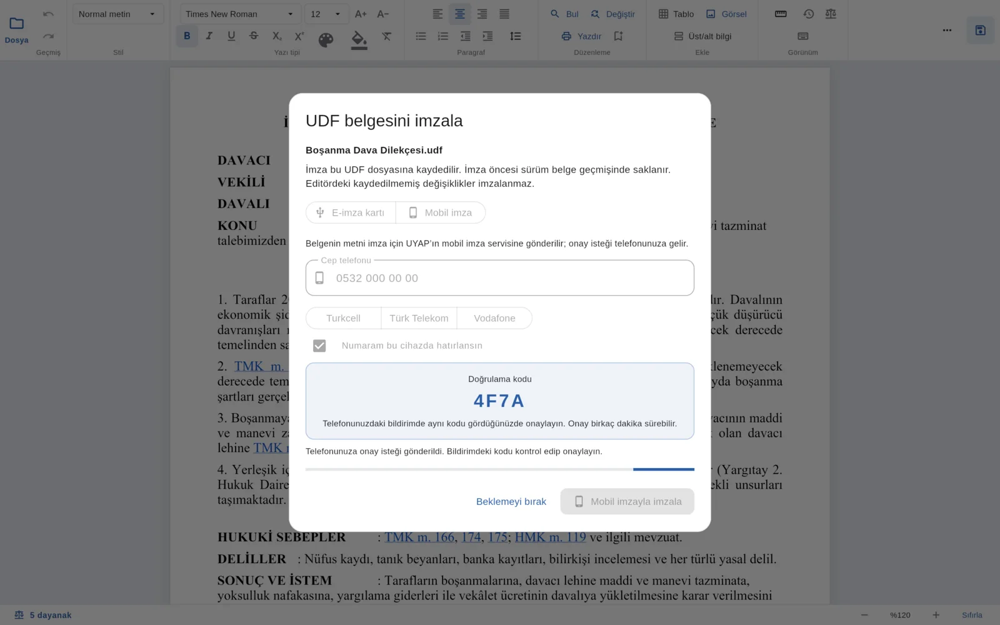 |

## UYAP'a bağlanma

Folio, UYAP Avukat Portalı'nın web arayüzünün kullandığı adreslerle çalışır; tarayıcıda portalı açmanız gerekmez. Bağlantı penceresinde üç yol vardır:

1. **Adalet E-İmza ile:** kartınız takılıyken PIN kodunuzu girersiniz; imzayı bilgisayardaki Adalet E-İmza uygulaması atar. Uygulama kurulu değilse bu seçenek pasif görünür ve Adalet Bakanlığı'nın [indirme sayfasına](https://eimza.adalet.gov.tr) bağlantı verilir; kurduktan sonra **Yeniden denetle** ile seçenek açılır.
2. **Mobil imza ile:** e-Devlet'in giriş sayfası Folio'nun açtığı küçük bir pencerede açılır; telefonunuza gelen onayı verirsiniz.
3. **E-imza ile, e-Devlet üzerinden:** aynı pencerede e-Devlet'in e-imza girişi kullanılır.

e-Devlet penceresi Linux'ta sistemin WebKitGTK'sıyla çalışan ayrı bir yardımcı programdır (`folio-edevlet`), Windows'ta Microsoft Edge WebView2'dir, macOS'ta sistemin WebKit'idir. Pencere geçici bir tarayıcı deposu kullanır; çerezler diske yazılmaz. e-Devlet UYAP'a geri yönlendirdiğinde bu yönlendirme yüklenmeden durdurulur ve içindeki kod Folio'ya verilir; kodu UYAP'a, oturumu açan Folio götürür.

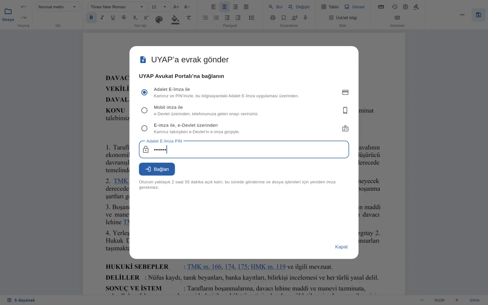

Oturum yaklaşık 2 saat 55 dakika açık kalır; bu sürede gönderme ve dosya işlemleri için yeniden imza gerekmez. Kalan süre UYAP penceresinde ve dosya panelinde görünür.

## UYAP'a evrak gönderme

İmzalı bir UDF, editörün **Dosya** menüsündeki **UYAP’a gönder** ile gönderilir. Mahkeme türü ve mahkeme seçilir, dosyanın yılı ve esas numarası yazılır. Folio dosyayı bulunca tarafları, vekilleri ve gönderilecek belgenin önizlemesini aynı ekranda gösterir. Evrak türü UYAP'ın o dosya için verdiği listeden seçilir; tür izin veriyorsa ek evrak (türü ve açıklamasıyla, dosya başına en fazla 64 MB) eklenir. Belge bir UYAP dosyasına bağlıysa o dosya baştan seçili gelir.

| Dosyayı seçin | Son kontrol |
|---|---|
| 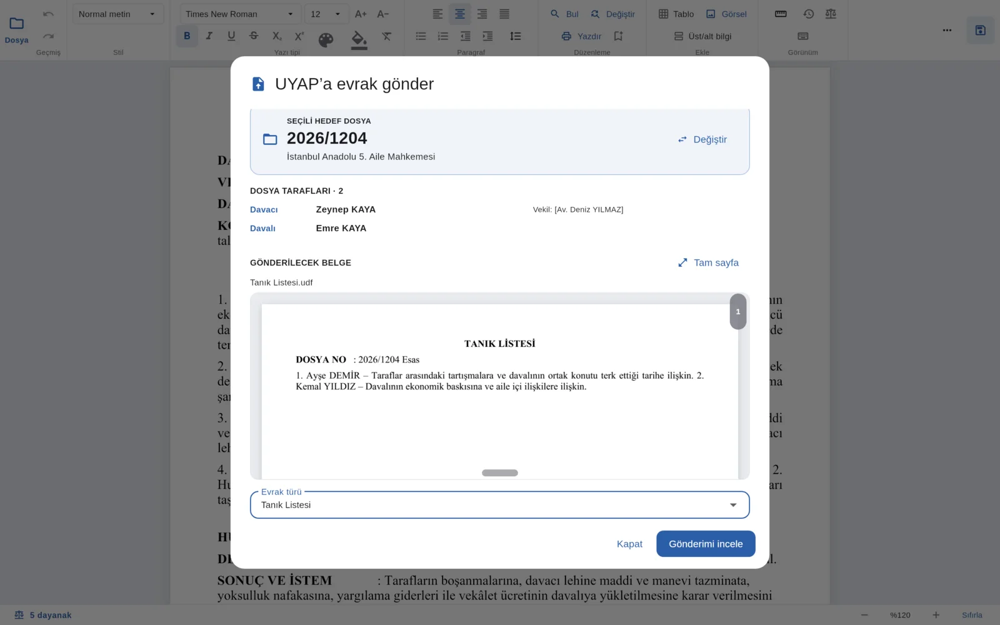 | 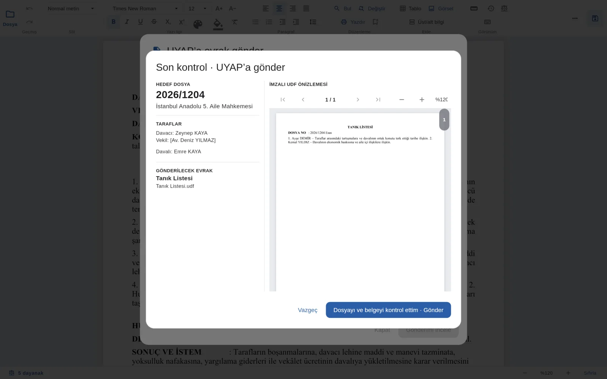 |

Dosya seçme penceresinde yıl ve esas numarası boş gelir; boş bırakılırsa mahkemedeki bütün dosyalar listelenir. **Gönderimi incele** son kontrol ekranını açar. Gönderilmeden hemen önce dosya numarası, taraflar, evrak türü ve belgenin kendisi yeniden denetlenir; bunlardan biri bu arada değiştiyse evrak gönderilmez ve neden gönderilmediği yazılır. Gönderilen evrak, UYAP'taki işlem tamamlanana kadar ana ekrandan açılan **UYAP Devam Eden İşlemler** listesinde izlenir.

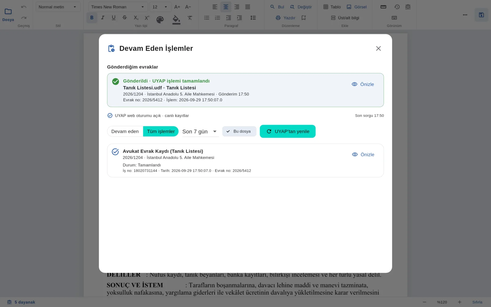

## UYAP Dosyalarım

Ana ekranın sol menüsünde, klasörlerin arasında **UYAP Dosyalarım** bulunur. Tıklandığında Folio'nun bu bilgisayarda sakladığı UYAP dosyaları listelenir ve dosyalar menüde onun altında açılır. Bir dosya, UYAP'tan bir kez çekildiği anda listeye girer; evrakının indirilmiş olması gerekmez.

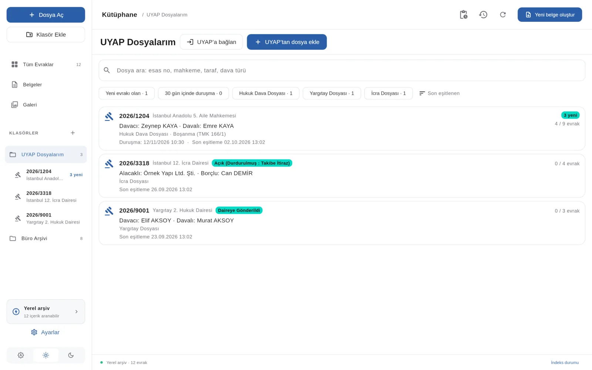

Her dosyanın kartında esas numarası, mahkemesi, tarafları rolleriyle, dosya ve dava türü, duruşma tarihi, son eşitleme zamanı, yeni evrak sayısı ve kaç evrakın indirildiği görünür. Dosya yalnız "Açık" değilse durumu ayrıca yazılır, örneğin "Açık (Durdurulmuş : Takibe İtiraz)" ya da "İstinafta". Arama kutusu esas numarasında, mahkemede, taraf ve vekil adlarında, dava türünde ve durumda arar. Filtreler yeni evrakı olan dosyaları, 30 gün içinde duruşması olanları ya da bir dosya türünü (Hukuk, İcra, Yargıtay…) gösterir. Liste son eşitlemeye, yaklaşan duruşmaya ya da esas numarasına göre sıralanır.

Sayfanın üstündeki **UYAP'a bağlan** oturumu açar; bağlıyken yerinde kalan oturum süresi görünür. **UYAP'tan dosya ekle** ile yargı türü, mahkeme türü, mahkeme ve isteğe bağlı olarak yıl ve esas numarası seçilir. Yıl ve numara boş bırakılırsa o mahkemedeki bütün dosyalar listelenir. Yargıtay ve Danıştay dosyaları da eklenir: bunlarda mahkeme yerine avukatın dosyası olan daireler listelenir; yıl ve numara dairenin dosyalarını süzer. Folio portföyün tamamını kendiliğinden çekmez; her dosya isteyerek eklenir, çünkü UYAP aynı anda tek isteğe izin verir.

Bir dosyaya tıklanınca dosya sayfası açılır. Geniş ekranda solda dosya bilgileri ve taraflar, sağda sekmeler bulunur; dar ekranda dosya bilgileri de bir sekmedir.

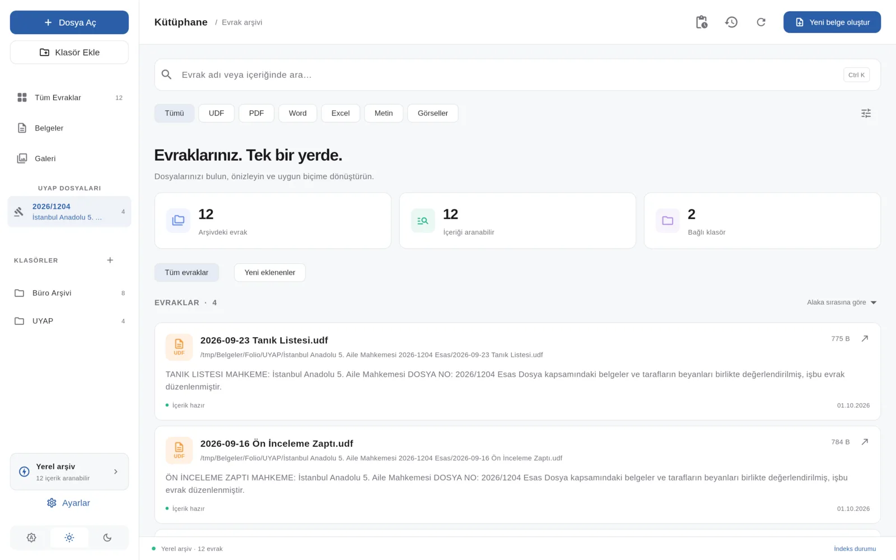

- **Dosya bilgileri:** dosya türü, dava türü, açılış türü, ayrıntılı durum, açılış ve kapanış tarihi, duruşma, keşif ve ön inceleme, karar ve istinaf ya da Yargıtay aşamasındaki dosyada yerel mahkemenin kararı, bağlı dosyalar. İcra dosyasında ayrıca takip türü, şekli ve yolu ile alacak toplamı, faiz, masraf, vekâlet ücreti, tahsil harcı ve yapılmış tahsilat. Yargıtay ve Danıştay dosyasında konu, daireye geliş tarihi ve yerel mahkeme.
- **Evraklar:** dosyanın kendi evrakı en üstte ve açık gelir; bağlı dosyaların evrakı ayrı gruplar hâlinde kapalı gelir ve tıklanınca açılır. Arama, bulduğu grupları kendiliğinden açar.
- **İndirilen:** bu bilgisayardaki evrak; tıklanan evrak Folio'nun önizlemesinde açılır.
- **Dilekçeler:** editörde bu dosyaya bağlanmış belgeler.
- **Harç ve tahsilat:** toplam tahsilat, reddiyat, teminat ve kalan; harçlar, tahsilatlar ve reddiyatlar makbuz no, tarih, ödeyen ve tutarla.

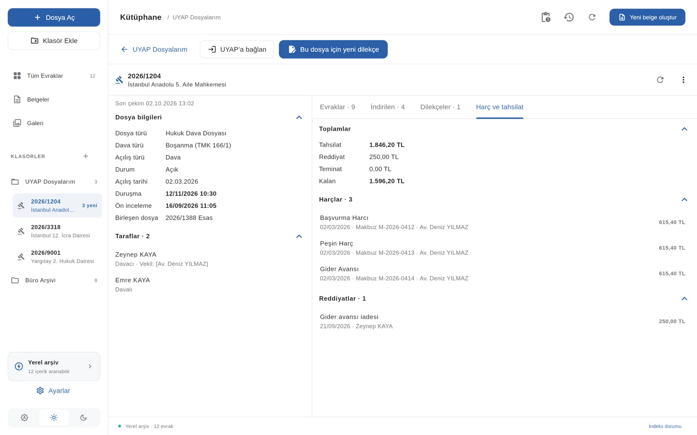

Dosya sayfasındaki yenile düğmesi dosyayı UYAP'tan yeniden çeker. Folio önce UYAP'a o dosya türünde nelerin gösterildiğini sorar ve yalnız onları ister; örneğin ceza dosyasında dosya bilgileri istenmez, sayfada "UYAP bu dosya türünde dosya bilgilerini göstermiyor" yazar. Önceki bir Folio sürümünün kaydettiği ve UYAP'taki yerini bilmeyen dosyada ilk yenilemede mahkeme ve esas numarası bir kez seçilir. **Bu dosya için yeni dilekçe** editörü bu dosyaya bağlı yeni bir UDF ile açar; **Listeden kaldır** dosyayı yalnız Folio'nun listesinden çıkarır, UYAP'taki dosyaya dokunmaz ve indirilen evrakın da silinip silinmeyeceğini ayrıca sorar.

## UYAP dosyası editörün yanında

Editörün araç çubuğundaki **UYAP dosyası**, sayfanın yanında bir panel açar. Belgeyi bir UYAP dosyasına bağladığınızda panelde dosya sayfasındaki bilgiler görünür: dosya bilgileri, taraflar ve vekilleri, dosyadaki bütün evrak. Bir tarafın adı **Metne ekle** ile imlecin bulunduğu yere yazılır. Bağlarken önce bu bilgisayardaki dosyalar listelenir; bunlardan biri UYAP oturumu olmadan seçilebilir. Bağ belgeyle birlikte hatırlanır; belge sonra açıldığında panel aynı dosyayla gelir ve belge dosya sayfasının **Dilekçeler** sekmesinde görünür. Panel sürüklenerek genişletilip daraltılabilir.

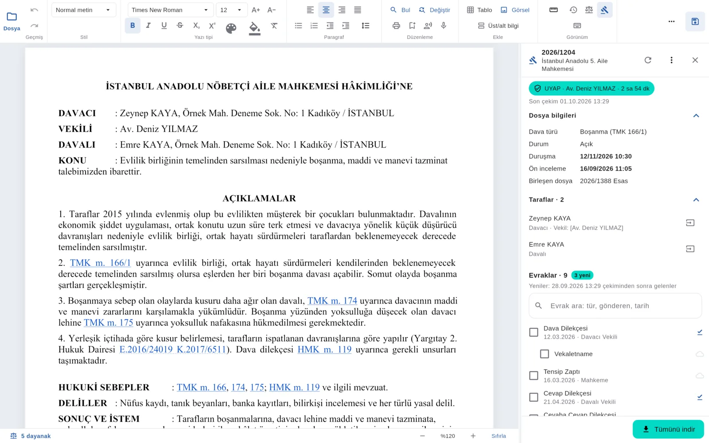

Evrak listesi her çekildiğinde tarihiyle saklanır. Son çekimden sonra gelen evrak **Yeni** olarak işaretlenir ve listenin başında kaç yeni evrak olduğu yazar. Listede evrak türüne, gönderene ve tarihe göre arama yapılabilir. İndirilmiş evrak işaretlidir. Bir evraka tıklayınca evrak dilekçenin yanında açılır; istenirse ayrı bir pencereye taşınır.

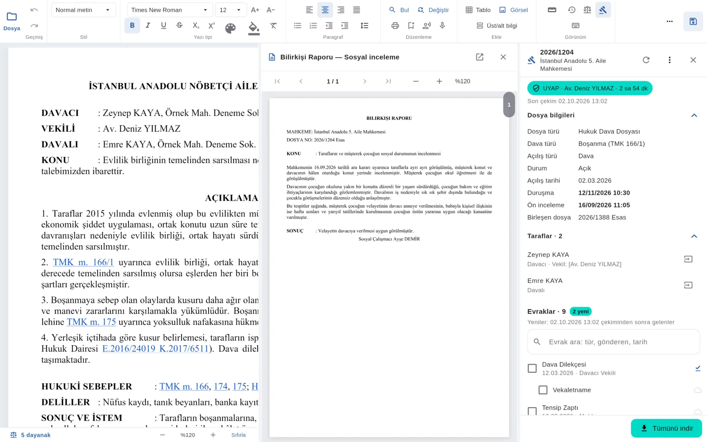

Evrak tek tek işaretlenip **Seçilenleri indir** ile ya da **Tümünü indir** ile toplu indirilir. Evrak UYAP'taki özgün hâliyle, UDF ise UDF olarak kaydedilir; önizleme için üretilen PDF kaydedilmez. Daha önce indirilen evrak yeniden indirilmez. Dosyanın bilgileri ve evrak listesi de bilgisayara kaydedildiği için panel internet bağlantısı olmadan son çekilen hâliyle açılır.

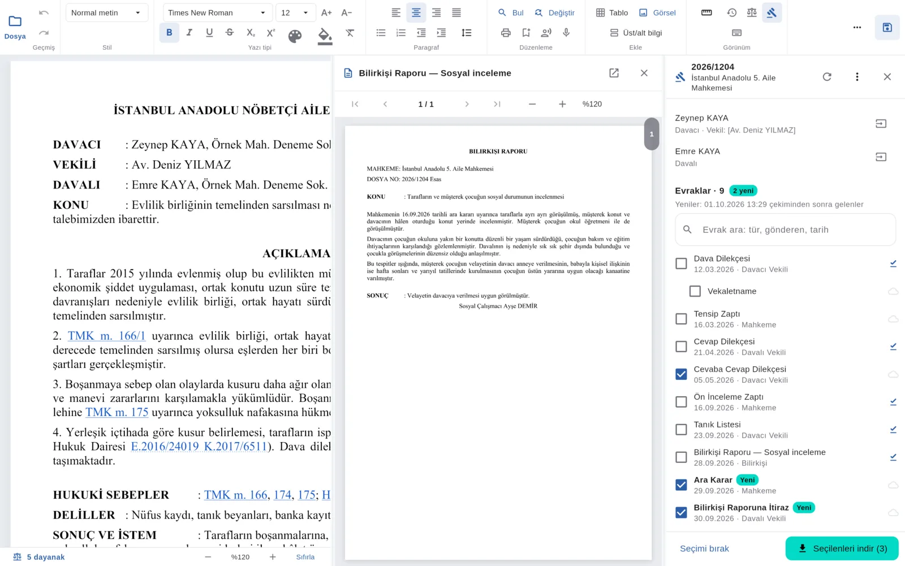

İndirilen evrak varsayılan olarak ev klasöründeki `Folio/UYAP` altında, her dosya için mahkeme adı ve esas numarasıyla adlandırılmış bir klasöre kaydedilir. Belgeler klasörü bilerek önerilmez: Windows onu OneDrive'a taşıyabilir. Kaydetme ilk kurulumda açıktır; panelin **Kayıt ayarları** bölümünden kapatılabilir ya da klasör değiştirilebilir. Kayıt klasörü arşive kendiliğinden eklenir, yani indirilen evrakın içinde de arama yapılır.

Dosya kimlikleri UYAP'ta oturuma bağlı olduğu için Folio dosyaları mahkeme ve esas numarasıyla, evrakı UYAP'ın evrak numarasıyla tanır; böylece yeni bir oturumda da aynı dosya ve evrak eşleşir. LifeOS Editör ile Folio aynı kayıtları kullanır.

## PDF vurgulama

PDF önizlemesinde metin seçilir ve araç çubuğundaki **vurgula** düğmesiyle işaretlenir; beş renk arasından seçim yapılır. Vurguya tıklamak rengi değiştirme ve silme menüsünü açar.

**Vurgular kaynak PDF'e yazılmaz.** İşaretler uygulamanın yerel indeksinde tutulur ve önizlemede belgenin üzerine çizilir; PDF dosyası bayt bayt aynı kalır. Bu sayede salt okunur, elektronik imzalı ve buluttan çevrimdışı gelen belgeler de işaretlenebilir; imza geçersiz olmaz. İşaretler dosya yoluna göre saklandığından belge taşınırsa yeni konumda görünmez.

Fare tekerleği sayfanın her yerinde kaydırır; imleç bir vurgunun ya da kanun atfının üzerindeyken de kaydırma durmaz.

Vurgular arşive eklenmemiş, doğrudan işletim sisteminden açılan PDF'lerde de çalışır. UDF veya DOCX'ten üretilen PDF önizlemesi geçici olduğu için orada vurgulama sunulmaz. Sayfa döndürüldüğünde işaretler sayfayla birlikte döner; konumları döndürülmemiş sayfaya göre saklanır.

## Taranmış belgeleri okuma (OCR)

**Ayarlar → Taranmış belgeleri oku (OCR).** Metin katmanı olmayan PDF'lerin sayfaları ve görseller Tesseract ile okunur, çıkan metin indekse girer ve belge aranabilir hale gelir. Tipik bir arşivde belgelerin beşte biri bu durumdadır.

OCR'dan geçen belgeler ana sayfadaki **Görüntüden okunan** filtresiyle ayrıca listelenir; bu filtre yalnız OCR'dan geçmiş belge varsa görünür. Adı "görsel" değil, çünkü bunların çoğu taranmış PDF'tir: ortak yanları metnin belgeden değil sayfanın görüntüsünden okunmuş olmasıdır.

Arşive eklenmemiş, doğrudan işletim sisteminden açılan bir belge de okunabilir: önizlemedeki **Metne dönüştür** düğmesi o anda OCR çalıştırır. Burada **daha doğru model** kullanılır: arşivin tamamı taranırken sayfa başına birkaç saniye fazlası yarım saate döner, ama tek bir belge için beklenebilir. Ölçüm (noter vekaletnamesi, tek sayfa): hızlı model 3,4 sn ve bütün kalması gereken 10 ifadenin 9'u, doğru model 6,0 sn ve 10'da 10. Yüksek DPI ikisinde de daha kötü sonuç verdiği için 200 DPI kullanılır. Bu işlem belgeyi arşive eklemez, indekse hiçbir şey yazmaz; yalnız ekranda gösterir. Taranmış PDF, TIFF ve görsel önizlemelerinin hepsinde bulunur.

Önizlemede **Okunan metin** düğmesi, belgenin yanında OCR'ın çıkardığı metni gösterir; seçilebilir ve kopyalanabilir. Bu metin **arama içindir, birebir çeviriyazı değildir**: tanıma hataları olabilir ve kutulu bölümler (noter kaşesi, antet) ana metnin arasına karışabilir — her sözcük doğru okunsa bile sıralama sayfadakinden farklı olabilir. Aramayı etkilemez; kaynak belge hiç değişmez.

**OCR klasörü seç** ile OCR'ın hangi klasörlere uygulanacağı sınırlanabilir; her klasör için **alt klasörler dahil** ayrı işaretlenir. Hiç klasör seçilmezse arşivin tamamı kapsanır. Ayar penceresi, seçili kapsamda kaç belgenin okunmayı beklediğini yazar; kapsamı daraltmak, henüz başlamamış işleri de durdurur.

Başlangıçta **kapalıdır**: sayfa başına birkaç saniye işlemci gerektirir, açıp kapatmak kullanıcının kararıdır. Açtığınız anda arşivdeki aranamayan belgeler — "metin katmanı yok" ve "dosya adı aranabilir" durumundakiler — sıraya alınır ve kaç belge olduğu bildirilir. Zaten aranabilen belgeler yeniden okunmaz; tam yeniden tarama gerekmez.

Her görsel okunmaz: kısa kenarı 150 pikselin altındaki görüntüler ve SVG dosyaları atlanır. Arşiv klasörüne karışan bir simge teması binlerce 16×16 dosya demektir ve bunların hiçbiri aranabilir yazı taşımaz. Belge fotoğrafları bu sınırın çok üstündedir.

Sayfalar, önizleme için zaten pakette bulunan PDFium ile görüntüye çevrilir ve Tesseract'a **standart girdi üzerinden** sıkıştırmasız gri TIFF olarak verilir; belgenin hiçbir parçası geçici dosyaya yazılmaz. (Windows'ta Leptonica PGM gibi biçimleri bellekten okurken sayfayı `%TEMP%`'e yazıyordu; TIFF'i kendi bellek akışıyla okur.) Belge başına en fazla 20 sayfa okunur ve işlem 200 DPI'da yapılır. OCR bir tanıma işlemidir: çıkan metinde hata olabilir, kaynak belge hiç değiştirilmez ve önizlemede her zaman özgün sayfa gösterilir.

Linux ve Windows'ta sunulur; mobilde OCR yoktur. Tesseract 5.5.3 ve Türkçe dil verisi uygulamayla birlikte `tools/` altında sürümlenir ve SHA-256 ile doğrulanır — ayrı kurulum, indirme veya PATH ayarı gerekmez. Bileşen bulunamazsa ayar kapalı ve devre dışı görünür.

Türkçe karakterler iki aşamada korunur: Windows ikilisi `activeCodePage=UTF-8` manifestiyle derlenir, böylece **Müvekkil Özlem Şenoğlu\İhtarname.tif** gibi yollar araca bozulmadan ulaşır; okunan metin de bayt bayt değil UTF-8 olarak çözülür, yani `AİLE` indekse `AİLE` olarak girer. Her iki durum da otomatik testlerle sınanır. [Sürümler ve lisanslar](native_tools/README.md).

## Kayıpsız boyut küçültme

Araç çubuğundaki **Kayıpsız boyut küçült** düğmesi PDF, TIFF, PNG ve JPEG için kullanılabilir. Görüntü yeniden boyutlandırılmaz; kalite yüzdesi/DPI düşürülmez. Sonuç yalnız daha küçükse `_kucultulmus` adlı ayrı dosyaya yazılır. Önceden sıkıştırılmış her dosya küçülmeyebilir.

| Biçim | Yöntem | Çalışma zamanı gereksinimi |
|---|---|---|
| PDF | Nesne ve Flate akışlarını tekrar paketleme; görseller yeniden kodlanmaz | `qpdf` |
| TIFF | Tüm ana sayfalara kayıpsız Deflate | `tiffcp` (libtiff araçları) |
| PNG | IDAT akışını tekrar sıkıştırma; diğer parçalar aynen korunur | Uygulama içinde |
| JPEG | Kayıpsız Huffman optimizasyonu, metadata kopyalama | `jpegtran` |

İmza alanı bulunan PDF yeniden yazılmaz. TIFF'te üreticiye özel etiketler/alt IFD'ler için tam arşiv eşdeğerliği iddia edilmez; kaynak korunur. Windows ve Linux araçları gerekli DLL dosyalarıyla `native_tools/` altında sürümlenir ve her derlemede uygulamanın `tools/` klasörüne kopyalanır. Office/LibreOffice veya ayrı araç kurulumu gerekmez. Eksik/değişmiş araç dosyası derlemeyi durdurur. [Sürümler, lisanslar ve platform sınırları](native_tools/README.md).

## Mobil kullanım ve masaüstü sağ tuş menüsü

Telefon ana ekranında **Belge aç**, **Yeni belge oluştur**, son açılanlar ve paylaşım öndedir. Arama ayrı **Arşivde ara** alanındadır. Dışarıdan gelen dosyalar doğrudan önizlemeye açılır; tekil mobil dosya açılışı indekslemeyi beklemez ve kendiliğinden indeks kaynağı eklemez. Önizlemedeki **Düzenle / Paylaş** düğmeleri dokunmatik boyuttadır.

**Ayarlar → Sağ tuşa önizle ve düzenle ekle**, varsayılan uygulamayı değiştirmeden kullanıcıya özel bağlantılar kurar. Windows'ta desteklenen uzantılar için Explorer fiilleri eklenir (Windows 11'de klasik **Daha fazla seçenek göster** menüsünde bulunabilir). GNOME/Nemo'da sağ tuş → **Betikler**, KDE'de servis menüsü kullanılır. Linux yerel kurulum betiği bunları da ekler. Oturum veya dosya yöneticisi zorla yeniden başlatılmaz. Platform belgeleri: [GNOME Betikler](https://help.gnome.org/gnome-help/nautilus-behavior.html), [Windows Shell fiilleri](https://learn.microsoft.com/en-us/windows/win32/shell/fa-verbs).

Komut satırında `lifeos_folio --preview -- dosya.udf` önizlemeyi, `lifeos_folio --edit -- dosya.udf` doğrudan editörü açar. Aynı davranış uygulama zaten çalışırken de geçerlidir. Düzenleme yalnız UDF/DOCX/XLSX/ODT ve desteklenen metin biçimlerinde sunulur; görseller/PDF önizlenir.

## Varsayılan belge önizleyicisi

- **Linux:** Release klasörünü kalıcı yerine taşıyın ve uygulamayı açın. Ayarlar → **Varsayılan uygulama · dosya türlerini seç** üzerinden UDF, PDF, DOCX ve diğer desteklenen türlerden istediklerinizi seçin. Yalnız seçilen türler atanır; kayıt tamamlandığında atamalar kontrol edilir. `update-mime-database` / `update-desktop-database` araçları önerilir.
- **Windows:** Ayarlar → **Varsayılan uygulama**, kullanıcıya özel ProgID ve desteklenen uzantıları kaydeder, Windows Varsayılan uygulamalar ekranını açar. İstediğiniz belge türlerini oradan seçin. Yönetici izni ve `UserChoice` değişikliği kullanılmaz. Uygulamayı taşıdıktan sonra kayıt düğmesini yeniden kullanın.
- **Android:** Ayarlar → varsayılan önizleyici akışı, kullanıcıya gerçek bir belge seçtirip o belgenin MIME türüyle Android `ACTION_VIEW` çözücüsünü açar. LifeOS Folio → “Her zaman” seçilir; PDF, UDF, DOCX gibi her tür için işlem ayrı yapılır. Başka uygulama önceden varsayılansa onun uygulama ayrıntıları açılır ve varsayılanı temizledikten sonra akış tekrarlanır. Genel depolama izni gerekmez. `content://` ve `file://` açılışları uygulama kapalıyken/açıkken alınır. Sağlayıcı UDF'yi genel binary olarak bildirirse uzantı uygulamada kontrol edilir. Yeni belge, klasör eşitleme kuyruğunu beklemeden ayrı I/O işinde okunur. Ekran adları cihaz üreticisine göre değişebilir.

Platform kaynakları: [Android intent filtreleri](https://developer.android.com/training/basics/intents/filters), [Windows uygulama kaydı](https://learn.microsoft.com/en-us/windows/win32/shell/default-programs), [Linux MIME/desktop kaydı](https://specifications.freedesktop.org/desktop-entry/latest/mime-types.html).

## Güncellemeler

Folio yeni bir sürüm olduğunu kendisi bildirir. Sürüm bilgisi `lifeos.com.tr/surum/stable/<platform>.json` adresinden okunur ve uygulamaya gömülü Ed25519 anahtarıyla imzalanmış olmalıdır; imzası tutmayan ya da `lifeos.com.tr` dışındaki bir dosyayı gösteren bilgi yok sayılır. Paketler GitHub Actions'ta derlenir, imzalanır ve sunucuya gönderilir; sunucu imzayı yeniden denetledikten sonra yayınlar.

## macOS

macOS sürümü deneme aşamasındadır ve Apple tarafından imzalanmamıştır: paket ilk açılışta **Sistem Ayarları → Gizlilik ve Güvenlik → Yine de Aç** ile bir kez onaylanmalıdır. Paket hem Apple Silicon hem Intel Mac'lerde çalışır ve GitHub'ın macOS makinesinde `.github/workflows/macos.yml` ile üretilir. OCR ve PDF küçültme araçları macOS için ayrıca derlenir (`packaging/native/build_tools.py macos`, `merge_macos.py`). Kartla e-imza, e-Devlet ile giriş ve UYAP gönderimi Mac'te henüz gerçek kullanıcıyla denenmedi; genel kısayol Mac'te yoktur.

## Kullanılan bileşenler ve lisansları

LifeOS Folio, çoğu kendi alanında yılların emeği olan açık kaynak projelerin üzerine kuruludur. Aşağıdaki liste uygulamanın içinde gerçekten yer alan bileşenleri kapsar; her biri kendi lisansına tabidir ve bu belge onların koşullarını değiştirmez. Tam lisans metinleri `native_tools/licenses/`, `fonts/` ve **Hakkında** ekranındadır.

### Uygulama çatısı

| Bileşen | Lisans | Ne için |
|---|---|---|
| [Flutter](https://flutter.dev) / Dart | BSD-3-Clause | Uygulama çatısı, üç platform |
| [SQLite](https://sqlite.org) (`sqlite3`, `sqlite3_flutter_libs`) | Public domain / MIT | FTS5 tam metin indeksi |

### Belge okuma, yazma ve çizim

| Bileşen | Lisans | Ne için |
|---|---|---|
| [pdfrx](https://pub.dev/packages/pdfrx) + PDFium | MIT / BSD-3-Clause | PDF önizleme, metin çıkarımı, dönüşüm ve OCR için sayfa çizimi |
| [pdf](https://pub.dev/packages/pdf), [printing](https://pub.dev/packages/printing) | Apache-2.0 | PDF üretimi ve yazdırma |
| [flutter_quill](https://pub.dev/packages/flutter_quill) | MIT | Zengin metin editörü |
| [docx_creator](https://pub.dev/packages/docx_creator) | MIT | DOCX yazma |
| [archive](https://pub.dev/packages/archive) | MIT | UDF/DOCX/XLSX zip katmanı |
| [worksheet](https://pub.dev/packages/worksheet), [excel_plus](https://pub.dev/packages/excel_plus) | MIT / MIT | Excel tablo editörü; XLSX okuma, yazma ve formül hesaplama |
| [xml](https://pub.dev/packages/xml), [html](https://pub.dev/packages/html), [markdown](https://pub.dev/packages/markdown) | MIT / MIT / BSD-3-Clause | UDF, ODT, HTML ve Markdown ayrıştırma |
| [image](https://pub.dev/packages/image) | MIT | Görsel çözme ve dönüştürme |
| [flutter_svg](https://pub.dev/packages/flutter_svg) | MIT | SVG önizleme |

### Paketlenen yerel araçlar

Bunlar `native_tools/` altında kaynaktan derlenip ikili olarak sürümlenir; kullanıcının ayrıca bir şey kurması gerekmez.

| Bileşen | Sürüm | Lisans | Ne için |
|---|---|---|---|
| [Tesseract OCR](https://github.com/tesseract-ocr/tesseract) | 5.5.3 | Apache-2.0 | Taranmış belgeleri okuma |
| [Leptonica](https://github.com/DanBloomberg/leptonica) | 1.87.0 | BSD-2-Clause | Tesseract'ın görüntü katmanı |
| [qpdf](https://github.com/qpdf/qpdf) | 12.4.1 | Apache-2.0 | Kayıpsız PDF küçültme |
| [LibTIFF](https://libtiff.gitlab.io/libtiff/) | 4.7.2 | libtiff (BSD benzeri) | TIFF küçültme ve çözme |
| [libjpeg-turbo](https://libjpeg-turbo.org) | 3.1.2 | IJG / BSD-3-Clause / zlib | JPEG kayıpsız optimizasyon |
| [libpng](http://www.libpng.org) | 1.6.50 | PNG Reference Library v2 | PNG çözme |
| [zlib](https://zlib.net) | 1.3.1 | zlib | Sıkıştırma |
| Türkçe OCR modeli (`tessdata_fast`) | — | Apache-2.0 | Türkçe tanıma |

### Kriptografi ve e-imza

| Bileşen | Lisans | Ne için |
|---|---|---|
| [pointycastle](https://pub.dev/packages/pointycastle) | MIT | RSA/SHA-256 imza işlemleri |
| [asn1lib](https://pub.dev/packages/asn1lib) | BSD | CAdES/X.509 ayrıştırma |
| [crypto](https://pub.dev/packages/crypto) | BSD-3-Clause | Özet fonksiyonları |
| [ffi](https://pub.dev/packages/ffi) | BSD-3-Clause | PKCS#11 kart sürücüsü köprüsü |

### Masaüstü ve sistem tümleşmesi

| Bileşen | Lisans | Ne için |
|---|---|---|
| [window_manager](https://pub.dev/packages/window_manager), [tray_manager](https://pub.dev/packages/tray_manager) | MIT | Pencere başlığı ve sistem tepsisi |
| [dbus](https://pub.dev/packages/dbus) | MPL-2.0 | Linux global kısayol portalı |
| [file_picker](https://pub.dev/packages/file_picker) | MIT | Dosya seçici |
| [desktop_drop](https://pub.dev/packages/desktop_drop) | Apache-2.0 | Sürükle-bırak |
| [url_launcher](https://pub.dev/packages/url_launcher) | BSD-3-Clause | Bağlantı ve dosya açma |
| [watcher](https://pub.dev/packages/watcher) | BSD-3-Clause | Klasör değişikliği izleme |
| [path](https://pub.dev/packages/path), [path_provider](https://pub.dev/packages/path_provider), [intl](https://pub.dev/packages/intl) | BSD-3-Clause | Yol, dizin ve yerelleştirme |

### Ses ve tarayıcı

| Bileşen | Lisans | Ne için |
|---|---|---|
| [sherpa_onnx](https://pub.dev/packages/sherpa_onnx) | Apache-2.0 | Sesli okuma ve sesli yazma modellerini çalıştırma |
| [flutter_soloud](https://pub.dev/packages/flutter_soloud) | MIT | Okunan sesi çalma |
| [flutter_recorder](https://pub.dev/packages/flutter_recorder) | Apache-2.0 | Mikrofondan ses alma |
| Supertonic 3 (Supertone) | OpenRAIL-M | Türkçe okuma sesi; ilk kullanımda indirilir |
| Whisper large-v3 turbo (OpenAI), Silero VAD | MIT | Konuşmayı yazıya geçirme; ilk kullanımda indirilir |
| [webview_windows](https://pub.dev/packages/webview_windows) | BSD-3-Clause | Windows'ta e-Devlet penceresi |
| WebKitGTK (sistemden) | LGPL-2.1 | Linux'ta e-Devlet penceresi |

### Yazı tipleri

[Liberation](https://github.com/liberationfonts), [Inter](https://rsms.me/inter/) ve [Lora](https://github.com/cyrealtype/Lora-Cyrillic) — hepsi **SIL Open Font License 1.1**. Fontlar yerel olarak paketlenir; hiçbir font için ağ bağlantısı kurulmaz.

### Lisans durumu

Listedeki bütün bileşenler açık kaynak lisanslıdır; ticari lisans gerektiren bir bileşen yoktur. PDF metni önceden `syncfusion_flutter_pdf` ile okunuyordu (Syncfusion Community License ya da ticari lisans gerektirir). 23 Eylül 2026'da PDFium'a geçildi ve paket bağımlılıklardan çıkarıldı.

## Teşekkür

Bu uygulamanın yaptığı işlerin neredeyse tamamı, başkalarının uzun yıllar boyunca karşılıksız yazdığı kodun üzerinde duruyor.

**Tesseract OCR** ve **Leptonica** geliştiricilerine: taranmış bir dilekçenin içindeki yazıyı bulunabilir kılan şey onların emeği. **qpdf**'ten Jay Berkenbilt'e, **LibTIFF**'ten Sam Leffler ve sürdürücülerine, **libjpeg-turbo**, **libpng** ve **zlib** ekiplerine — bu kütüphaneler otuz yıldır sessizce çalışıyor ve dosyalarımız onlar sayesinde bozulmadan duruyor.

**PDFium** ve **pdfrx**'e, belgeyi ekranda gerçekten göründüğü gibi çizdikleri için. **flutter_quill** ve **SQLite**'a; FTS5 olmasa 2000 belgede içerik araması bu hızda olmazdı. **Flutter** ekibine, tek kod tabanından üç platform için.

**Liberation**, **Inter** ve **Lora** yazı tiplerini özgürce kullanıma açanlara — Türkçenin bütün harflerini doğru çizen bir font, sanıldığından daha değerli.

Arama tasarımında [lifeoshukuk](https://github.com/07erkanoz/lifeoshukuk) projesindeki FTS5 ve arka plan indeksleme akışlarından; imzalama çekirdeğinde kendi `karararama` çalışmasından yararlanıldı.

Son olarak UDF biçimini kullanan meslektaşlara: bu uygulama, her gün açılan onlarca dosyanın biraz daha kolay bulunması için yazıldı.

## Derleme

Flutter **3.47.2**, Dart **3.13.2**. Android: JDK 17, SDK 36+ ve Flutter'ın istediği NDK. Linux: Flutter masaüstü gereksinimleri (CMake/Ninja/clang/GTK3), X11 ve AppIndicator geliştirme paketleri (`libx11-dev`, `libayatana-appindicator3-dev` veya `libappindicator3-dev`), e-Devlet penceresi için `libwebkit2gtk-4.1-dev`, mikrofon için `libasound2-dev`. macOS: Xcode; e-Devlet penceresi `swiftc` ile ayrıca derlenir (bkz. `.github/workflows/macos.yml`). İlk native SQLite/PDF derlemesi internet erişimi gerektirebilir.

```sh
flutter pub get
flutter analyze --no-pub
flutter test --no-pub
flutter build linux --release --no-pub
flutter build apk --release --no-pub
# Windows üzerinde:
flutter build windows --release --no-pub
./packaging/windows/build-installer.ps1
```

Windows kurulum çıktısı: `build/windows/installer/LifeOS-Folio-<sürüm>-Windows-x64-Setup.exe`.
Kullanıcı hesabına kurulur; kısayollar, isteğe bağlı dosya menüleri ve kaldırma
desteği içerir. Gerekli DLL'ler pakete dahildir; `pdfium.dll` derleme klasörüne girmezse Windows derlemesi hata verip durur, böylece önizlemesi çalışmayan bir paket çıkmaz. [Windows kurulum ayrıntıları](packaging/windows/README.md).

Linux: `build/linux/x64/release/bundle/lifeos_folio` — `data`, `lib` ve `tools` klasörleriyle birlikte dağıtılır. Android: `build/app/outputs/flutter-apk/app-release.apk`. APK release modundadır; şu anda geliştirme anahtarıyla imzalanır, mağaza dağıtımı için üretim keystore'u gerekir. **UDF e-imzası ile APK imzası farklı işlemlerdir.** Windows ve Android test paketleri GitHub Actions → **Windows ve Android test paketleri** → Run workflow ile alınabilir. İş akışı yalnız elle çalışır; push/PR tetiklemesi ve GitHub üzerinde Linux paket derlemesi yoktur.

Android'de Flutter'ın KGP uyumluluk bayrakları korunur; `file_picker` 11 için Kotlin derlemesi açıkça etkinleştirilir. [Flutter Kotlin geçiş açıklaması](https://docs.flutter.dev/release/breaking-changes/migrate-to-built-in-kotlin/for-app-developers).

Yeni ikon: [PNG](assets/branding/lifeos_folio.png), [üretim kaydı](assets/branding/README.md). Ürün adı LifeOS Folio; çalıştırılabilir dosya adı `lifeos_folio` (`lifeos_folio.exe`), iç paket kimliği ise `evrak_convert` olarak korunur. İndeksler, son aramalar, cihaz ayarları ve PIN/anahtarlar Git deposuna dahil edilmez. Ayrıntılı kapsam: [İnceleme notları](INCELEME_NOTLARI.md).

Linux uygulama menüsü ve görev çubuğu ikonunu yerel pakete bağlamak için:

```bash
python3 packaging/linux/install_local.py build/linux/x64/release/bundle/lifeos_folio
```

Bu komut kullanıcı menüsü ve ikon kaydını günceller; dosya türlerinin varsayılan uygulamasını değiştirmez. Desktop dosyası adı, `StartupWMClass` ve GTK uygulama kimliği `com.erkanoz.evrak_convert` olarak eşleşir.

## Masaüstünde hızlı arama

Ayarlar → **Masaüstünde hızlı arama**. Kapatınca tepside bekleme, seçilebilir global kısayol, sessiz indeksleme ve animasyonlu hızlı sonuçlar. Ana ekranla aynı sorgu, filtreler, geçmiş ve içerik araması kullanılır. [Kullanım ve platform ayrıntıları](docs/quick-search.md).
